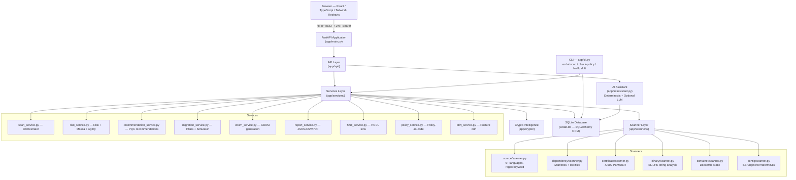

# CRYPTORA Architecture

CRYPTORA is an implementation of the **Enterprise Cryptographic Discovery & Analysis Tool (ECDAT)** problem statement. It is a defensive cybersecurity MVP that discovers cryptographic usage in source code, dependencies, certificates, binaries, and infrastructure configurations, then evaluates quantum-computing risk and recommends post-quantum (PQC) migration paths. It runs entirely offline; no paid or external services are required.

---

## System Architecture Diagram



---

## Pipeline (Scan Flow)

```
Input: repository path / directory / demo target
               │
     Scan Orchestrator  (app/services/scan_service.py)
               │
 ┌─────────────────────────────────────────────────────┐
 │  Source Code Scanner        app/scanners/source/    │
 │  Dependency Scanner         app/scanners/dependency/ │
 │  Certificate Scanner        app/scanners/certificate/│
 │  Binary Scanner             app/scanners/binary/    │
 │  Container Scanner          app/scanners/container/ │
 │  Config & Protocol Scanner  app/scanners/config/    │
 └─────────────────────────────────────────────────────┘
               │
  Raw findings → CryptographicArtefact rows (DB)
               │
  build_assets_from_artefacts()  (risk_service.py)
  Groups per (algorithm, file, purpose) → Asset rows
               │
  compute_risk_for_asset()  → RiskAssessment rows
  compute_mosca_for_asset() → MoscaAssessment rows
  compute_agility_for_asset() → agility_score on Asset
               │
  build_recommendations_for_scan()  → Recommendation rows
  build_migration_plans_for_scan()  → MigrationPlan rows
               │
  evaluate_policy() [optional]  → policy_violations on Scan
               │
  evaluate_hndl() [on demand]   → hndl_exposed on Asset rows
               │
  generate_cbom()               → CBOM JSON/CSV
  build_report_data() + export  → JSON/CSV/PDF reports
               │
  compute_posture_drift()       → Drift trend data
```

---

## Component Reference

### API Layer (`app/api/`)

Thin routing modules — each delegates immediately to `app/services/`. All routes except `/health` and `POST /api/auth/login` require a valid JWT Bearer token.

| Module | Prefix | Key Operations |
|---|---|---|
| `auth.py` | `/api/auth` | Login (JWT issue), Logout (stateless, client-side) |
| `scans.py` | `/api/scans` | Create scan (async background task), list, get, start, get results |
| `assets.py` | `/api/assets` | List and get cryptographic asset records |
| `cbom.py` | `/api/cbom` | Get CBOM JSON; export CBOM as JSON or CSV |
| `risks.py` | `/api/risks` | List risk assessments; risk summary |
| `mosca.py` | `/api/mosca` | List Mosca assessments; interactive simulation |
| `recommendations.py` | `/api/recommendations` | List PQC recommendations |
| `migration.py` | `/api/migration-plans` | List migration plans; priority view; simulate migration |
| `certificates.py` | `/api/certificates` | List discovered X.509 certificates |
| `libraries.py` | `/api/libraries` | List discovered crypto-capable libraries |
| `hndl.py` | `/api/hndl` | HNDL exposure lens (read-only derived view) |
| `reports.py` | `/api/reports` | Get report data; generate JSON/CSV/PDF; download |
| `ai.py` | `/api/ai` | AI assistant chat endpoint |
| `dashboard.py` | `/api/dashboard` | Aggregated dashboard metrics; posture drift |
| `deps.py` | — | JWT dependency (`get_current_user`) |
| `serializers.py` | — | SQLAlchemy → dict serializers (no Pydantic response_model needed) |

---

### Services Layer (`app/services/`)

#### `scan_service.py` — Scan Orchestrator

**Responsibility:** Coordinates all six scanners in sequence, persists raw `CryptographicArtefact` rows, then triggers the downstream analysis pipeline.

**Inputs:** `Scan` ORM row, target path, optional `since_ref` (git ref for diff-native mode), optional `policy_path`.

**Outputs:** Populated `CryptographicArtefact`, `Certificate`, `Dependency`, `Library`, `ScanEvidence` rows; triggers risk/Mosca/recommendation/migration; sets `policy_status` and `policy_violations` on the `Scan` row.

**Key behavior:**
- Diff-native mode: `get_changed_files_since()` calls `git diff --name-only` to build a `file_filter` set passed to all scanners. Falls back to full scan if git fails.
- One scanner failure records a `ScanEvidence` warning and does not abort the whole scan.

#### `risk_service.py` — Risk Engine + Mosca + Agility

**Responsibility:** Groups `CryptographicArtefact` rows into `Asset` rows; computes `RiskAssessment`, `MoscaAssessment`, and agility/migration-priority scores.

**Risk scoring model (`compute_risk_for_asset`):**
- Additive, capped at 100. Every factor is stored in `RiskAssessment.factors`.
- Severity thresholds: 0–24 LOW · 25–49 MEDIUM · 50–74 HIGH · 75–100 CRITICAL (configurable).

**Agility scoring (`compute_agility_for_asset`):**
- Three dimensions: abstraction mechanism (15–50 pts), version pinning (5–25 pts), call-site blast radius (3–25 pts).
- Migration priority = `risk_score / max(1, agility_score)`.

**Mosca model (`compute_mosca_for_asset`):**
- `X` = `BusinessAsset.data_retention_years` (default 5 if no business context).
- `Y` = `BusinessAsset.estimated_migration_years` (default 1.5).
- `Z` = `settings.DEFAULT_THREAT_HORIZON_YEARS` (default 10, fully configurable per simulation).
- Result: URGENT MIGRATION / PLAN MIGRATION / MONITOR / LOW PRIORITY.

#### `recommendation_service.py` — PQC Recommendation Engine

**Responsibility:** Maps each `Asset`'s current algorithm (from the offline knowledge base) to a purpose-aware PQC recommendation.

**Key design principle:** Recommendations are purpose-aware. ML-KEM is recommended for key establishment; ML-DSA for signatures. The engine never claims ML-KEM replaces RSA signatures.

**PQC algorithms referenced:** ML-KEM (FIPS 203), ML-DSA (FIPS 204), SLH-DSA (FIPS 205), hybrid constructions (X25519+ML-KEM, ECDSA+ML-DSA).

**Symmetric algorithms:** AES-256, AES-256-GCM, ChaCha20-Poly1305 are not flagged for algorithm replacement — the engine notes that key size (not algorithm type) is the Grover mitigation.

#### `cbom_service.py` — CBOM Generation

**Responsibility:** Generates the Cryptographic Bill of Materials from `Asset` rows.

**Output format:** ECDAT-CBOM schema, explicitly labelled as not CycloneDX-conformant. Exports JSON and CSV.

**Schema fields per component:** id, type, algorithm, key_size, purpose, location, component, confidence, business_asset, quantum_security (risk severity), risk_score.

#### `report_service.py` — Report Generation

**Responsibility:** Assembles full scan report data and exports to JSON, CSV, or PDF.

**Formats:**
- JSON: executive summary, CBOM inventory, critical findings, quantum risk summary, PQC recommendations, migration priorities, HNDL lens, certificates, libraries, limitations disclaimer.
- CSV: CBOM table + HNDL section appended.
- PDF: executive summary, quantum risk table, critical findings, PQC recommendations, limitations (via ReportLab). Capped at 25 critical findings and 30 PQC recommendations in the PDF.

**Limitations note:** Reports explicitly include a `limitations` field listing known model limitations (static analysis, ECDAT risk model, configurable threat horizon).

#### `hndl_service.py` — Harvest-Now-Decrypt-Later Lens

**Responsibility:** Read-only derived projection over existing `Asset` + `BusinessAsset` rows. Flags assets at risk of "harvest now, decrypt later" attacks.

**Three-factor gate (all must hold):**
1. Internet-exposed OR captured-in-transit (via `BusinessAsset.internet_exposed` or transport-crypto hints in component/location: TLS/SSL/SSH/DTLS/QUIC/HTTPS/STARTTLS).
2. Long data shelf-life: `BusinessAsset.data_retention_years` ≥ `HNDL_SHELF_LIFE_THRESHOLD_YEARS` (default 10).
3. Quantum-vulnerable key establishment (offline knowledge base + asset purpose).

**Writes:** `Asset.hndl_exposed` and `Asset.hndl_reason` columns (additive, never replaces scanner data).

#### `policy_service.py` — Policy-as-Code Evaluation

**Responsibility:** Loads `ecdat-policy.yaml` and evaluates five rule families against a completed scan's assets/artefacts.

**Rule families:**
1. Disallowed algorithms (with optional `min_key_size`, `include_paths`, `exclude_paths`)
2. Internet-exposed PQC readiness (with optional `deadline` and `enforce_immediately`)
3. Minimum agility score threshold
4. Maximum risk score ceiling
5. Provenance-risk sign-off (`ai_suspected` findings require human review)

**Important limitation:** Rule matching is keyword-based; does not support arbitrary expressions. Inherits all scanner detection limitations.

#### `drift_service.py` — Posture Drift Analytics

**Responsibility:** Computes chronological trends across historical completed scans for the same target.

**Tracks per scan:** vulnerable-artefact count, PQC-artefact count, PQC adoption %, average migration priority, critical/high risk counts.

**Outputs:** History array + delta summary (first vs last scan).

#### `migration_service.py` — Migration Plans + Simulator

**Responsibility:** Generates `MigrationPlan` rows after each scan; provides interactive simulation via `POST /api/migration-plans/simulate`.

**Simulation:** Maps `(language, current_library, algorithm, purpose)` tuples to offline replacement guidance (`app/crypto/remediation.py`). Provides target library, minimum version, replacement API, hybrid construction, diff template. Never fabricates benchmark numbers.

---

### Scanner Layer (`app/scanners/`)

#### Source Code Scanner (`source/scanner.py`)

- **Method:** Regex/keyword static analysis, line by line. NOT AST or data-flow.
- **Languages:** Python, JavaScript, TypeScript, Java, Go, Rust, C, C++, Ruby, Dockerfile.
- **Files skipped:** > `MAX_FILE_SIZE_BYTES` (5 MB default), or > `MAX_FILES_PER_SCAN` (20,000 default), or `ecdat-policy.yaml` files.
- **Provenance heuristic:** Sets `provenance_risk = "ai_suspected"` when tutorial-boilerplate patterns match (via `app/crypto/provenance.py`).
- **Deduplication:** `dedupe_findings()` removes duplicate algorithm+file+line combinations before persisting.

#### Dependency Scanner (`dependency/scanner.py`)

- **Manifests parsed:** `requirements.txt`, `pyproject.toml`, `package.json`, `pom.xml`, `go.mod`, `Cargo.toml`.
- **Lockfiles parsed:** `poetry.lock`, `package-lock.json`, `Cargo.lock`, `go.sum`, `pnpm-lock.yaml`, `Gemfile.lock`.
- **Dockerfiles:** Scans `apt-get install` / `apk add` / `yum install` for named crypto packages.
- **Knowledge-base lookup:** Package names are matched against `knowledge-base/libraries/crypto_libraries.json` + `bundled_crypto_libraries.json`.
- **Transitive dependency tracking:** `is_transitive`, `depth`, `parent_dependency`, `provenance_chain` are populated for lockfile-sourced indirect deps.
- **No CVE data.** Never fabricates vulnerability scores.

#### Certificate Scanner (`certificate/scanner.py`)

- **File types:** `.pem`, `.crt`, `.cer`, `.der`.
- **Parser:** Python `cryptography` library X.509 parser (PEM and DER).
- **Extracts:** subject, issuer, serial_number, valid_from, valid_until, expired, days_remaining, public_key_algorithm, key_size, signature_algorithm, SANs, `weak_key` (RSA/DSA < 2048 bits), `weak_signature` (SHA-1 or MD5).
- **Security:** Explicitly refuses to parse files containing private key markers (`PRIVATE KEY`, `RSA PRIVATE KEY`, `EC PRIVATE KEY`).
- **Limitation:** No chain validation. Only leaf certificate analyzed.

#### Binary Scanner (`binary/scanner.py`)

- **Formats:** ELF (magic `\x7fELF`) and PE (magic `MZ`).
- **Method:** Reads up to 20 MB of file bytes, extracts printable ASCII strings (≥5 chars), matches against `CRYPTO_STRING_MARKERS` (libcrypto, libssl, libsodium, mbedtls, wolfssl, AES_encrypt, RSA_public_encrypt, EVP_EncryptInit, SHA256_Init, ecdsa, chacha20, etc.).
- **Every finding is explicitly described as evidence of linkage, not confirmed runtime use.**
- Never executes the binary.

#### Container Scanner (`container/scanner.py`)

- **Method:** Static Dockerfile parsing only. No Docker daemon, no image pull, no container execution.
- **Extracts:** `FROM` base image names; crypto packages installed via `apt-get`/`apk`/`yum` (delegated to dependency scanner); certificates copied into the build context (delegated to certificate scanner); crypto libraries in binaries (delegated to binary scanner).
- **Limitation:** Cannot see runtime state or layers not reflected in the Dockerfile.

#### Config & Protocol Scanner (`config/scanner.py`)

- **Targets:** `sshd_config` / `ssh_config`, nginx `nginx.conf` + Apache `httpd.conf`, `openssl.cnf` / `openssl.conf`, `java.security`, Terraform `*.tf` / `*.tfvars` / `*.tf.json`, YAML files for Kubernetes TLS Secrets (`kubernetes.io/tls`) and cert-manager CRDs (Certificate, Issuer, ClusterIssuer).
- **Extracts:** Cipher suites, key-exchange algorithms, TLS protocol versions, RSA/EC key specs (Terraform KMS/ACM), TLS policy ARNs, cert-manager private-key algorithm + size.
- **Limitation:** Static file analysis only. No live TLS handshakes, no dynamic Terraform state resolution.

---

### Crypto Intelligence (`app/crypto/`)

#### `knowledge_base.py`

Loads algorithm metadata from `knowledge-base/algorithms/algorithms.json` and provides:
- `get_algorithm(name)` — returns algorithm metadata dict or `None`.
- `is_quantum_vulnerable(name)` — returns bool based on the `quantum_vulnerable` field.

#### `classifier.py`

Line-level classification called by the source scanner. Returns a list of `CryptographicArtefact` finding dicts for each source line.

#### `algorithms.py`

- `SUPPORTED_SOURCE_EXTENSIONS` — dict mapping file extensions to language names.
- `DOCKERFILE_NAMES` — set of recognized Dockerfile name variants.
- Detection pattern definitions (regular expressions and keyword lists) for each supported language.

#### `provenance.py`

Deterministic regex-based heuristic for tutorial-boilerplate crypto patterns. Sets `provenance_risk = "ai_suspected"` on artefacts matching hardcoded IV/salt/nonce/key literals, explicit ECB mode, or plaintext/ciphertext string bindings. Not ML.

#### `remediation.py`

Offline knowledge table mapping `(language, current_library, algorithm, purpose)` → `(target_library, minimum_version, replacement_api, hybrid_construction, diff_template)`. Used by the Migration Simulator. Read-only — never applied to source files.

---

### Data Model (`app/models/models.py`)

All SQLAlchemy models in a single module. Key relationships:

```
Scan
  ├── ScanTarget (files scanned, 1:N)
  ├── CryptographicArtefact (raw per-file findings, 1:N)
  │       └── → Asset (grouped unit, M:1)
  └── ScanEvidence (warnings/errors, 1:N)

Asset
  ├── RiskAssessment (1:1)
  ├── MoscaAssessment (1:1)
  ├── Recommendation (1:1)
  └── → BusinessAsset (N:1, path-based matching)

BusinessAsset
  └── DataAsset (1:N)

Scan ──→ Certificate (1:N)
Scan ──→ Dependency (1:N)
Scan ──→ Library (1:N)
Scan ──→ Protocol (1:N)
Asset ──→ MigrationPlan (1:N, via asset_id FK)

Algorithm  (knowledge base entries, seeded from algorithms.json)
User ──→ Organization (N:1)
```

---

### Core Layer (`app/core/`)

| Module | Responsibility |
|---|---|
| `config.py` | `Settings` class (pydantic-settings), environment variable bindings, all defaults |
| `database.py` | SQLAlchemy engine, `SessionLocal`, `Base`, `init_db()`, `get_db()` dependency |
| `security.py` | `verify_password()` (bcrypt), `create_access_token()` (JWT HS256), `decode_token()` |
| `logging.py` | Structured logger + `audit()` function (logs login, scan_completed events) |
| `seed.py` | `seed_all()` — seeds demo users and algorithm knowledge base on startup |

---

### CLI (`app/cli.py`)

Four subcommands:

| Command | Description |
|---|---|
| `ecdat scan <target>` | Full or diff-native (`--since <ref>`) scan; optional `--policy`; exits 0/1/2 |
| `ecdat check-policy <target>` | Re-evaluates policy rules against existing scan data |
| `ecdat hndl <target>` | HNDL exposure lens over most recent scan for target |
| `ecdat drift <target>` | Crypto-posture drift trend dashboard across historical scans |

All commands are offline and read-only.

---

### Frontend (`frontend/src/`)

React + TypeScript + Vite + Tailwind CSS. Communicates with the backend over `/api/*` (proxied to `localhost:8000` in development via `vite.config.ts`).

**Pages (20 total):**

| Route | Page | Backend Calls |
|---|---|---|
| `/` | Dashboard | `GET /api/dashboard` |
| `/scan` | Scan (create + monitor) | `POST /api/scans`, `GET /api/scans/{id}` |
| `/scan-history` | Scan History | `GET /api/scans` |
| `/inventory` | Cryptographic Asset Inventory | `GET /api/assets` |
| `/assets/:id` | Asset Detail | `GET /api/assets/{id}` |
| `/cbom` | CBOM Explorer | `GET /api/cbom` |
| `/dependency-graph` | Dependency Graph | `GET /api/assets`, dependency data |
| `/quantum-risk` | Quantum Risk | `GET /api/risks` |
| `/mosca` | Mosca Analysis | `GET /api/mosca`, `POST /api/mosca/simulate` |
| `/recommendations` | PQC Recommendations | `GET /api/recommendations` |
| `/migration-simulator` | Migration Simulator | `POST /api/migration-plans/simulate` |
| `/certificates` | X.509 Certificates | `GET /api/certificates` |
| `/libraries` | Crypto Libraries | `GET /api/libraries` |
| `/containers` | Container Analysis | Container data via assets |
| `/reports` | Reports | `POST /api/reports`, `GET /api/reports/download/{filename}` |
| `/ai-assistant` | AI Assistant | `POST /api/ai/chat` |
| `/posture-drift` | Posture Drift | `GET /api/dashboard/drift` |
| `/hndl-exposure` | HNDL Exposure | `GET /api/hndl` |
| `/settings` | Settings | Local config |
| `/login` | Login | `POST /api/auth/login` |

**Authentication flow:** JWT token stored client-side; Axios interceptor attaches `Authorization: Bearer <token>` to all requests; 401 responses redirect to `/login`. Logout discards the token client-side.

---

## Design Decisions and Tradeoffs

### Regex/keyword source scanning, not AST/data-flow

Static pattern matching is far cheaper to build and reason about, and is transparent about its limits (see `docs/limitations.md`) rather than claiming to prove runtime behavior it cannot prove. The scanner explicitly annotates findings as "usage detected via static pattern match."

### SQLite by default

Zero configuration, matches the "runnable locally without paid services" requirement. The schema uses only portable SQLAlchemy types — moving to PostgreSQL is a `DATABASE_URL` environment variable change, not a schema rewrite.

### Deterministic AI fallback

The AI Assistant always works offline in deterministic mode (keyword-routed query over scan data). The "must work without AI" requirement is treated as a hard constraint, not a stretch goal.

### CBOM schema explicitly not CycloneDX-conformant

Rather than emit a document claiming CycloneDX conformance without passing CycloneDX schema validation, CRYPTORA emits a simpler, honestly-labelled schema. A production follow-up should map onto the official CycloneDX CBOM JSON schema.

### Additive risk model

Factors are additive, not probabilistic. This is transparent and explainable but does not model factor interactions. See `docs/risk-model.md` for known limitations.

### HNDL as a derived lens, not a new scanner

HNDL re-reads existing data. It does not perform live packet capture, live TLS inspection, or network connections.

---

## Knowledge Base Files

| File | Contents |
|---|---|
| `knowledge-base/algorithms/algorithms.json` | Per-algorithm metadata: name, category, classical security bits, quantum_vulnerable, recommended_pqc, recommended_hybrid, migration_complexity, performance/compatibility notes |
| `knowledge-base/libraries/crypto_libraries.json` | Per-package metadata: crypto_capable flag, known_algorithms list |
| `backend/app/scanners/dependency/bundled_crypto_libraries.json` | Bundled subset of library knowledge base (packaged inside the scanner for offline use) |

---

## Security Notes

- **Authentication:** JWT HS256, bcrypt passwords. Change `SECRET_KEY` in any deployed environment.
- **No execution:** Every scanner is read-only. Nothing is executed, installed, or imported from targets.
- **Subprocess safety:** Only `git diff --name-only` and `git ls-files` are called. No user-supplied input is shell-interpolated.
- **Private key protection:** The certificate scanner explicitly refuses files containing `PRIVATE KEY`, `RSA PRIVATE KEY`, or `EC PRIVATE KEY` markers.
- **Report path safety:** Download filenames are sanitized with `os.path.basename`.
- **External AI:** Source code is never sent externally unless `AI_ALLOW_EXTERNAL_CONTEXT=true`.
- **MVP authentication limitations:** No MFA, no rate limiting on login, no session revocation list. Not hardened for production public deployment.

---

*See also: [`docs/risk-model.md`](risk-model.md), [`docs/cbom.md`](cbom.md), [`docs/mosca.md`](mosca.md), [`docs/pqc-migration.md`](pqc-migration.md), [`docs/limitations.md`](limitations.md), [`docs/diff-native-ci.md`](diff-native-ci.md), [`docs/references.md`](references.md)*
